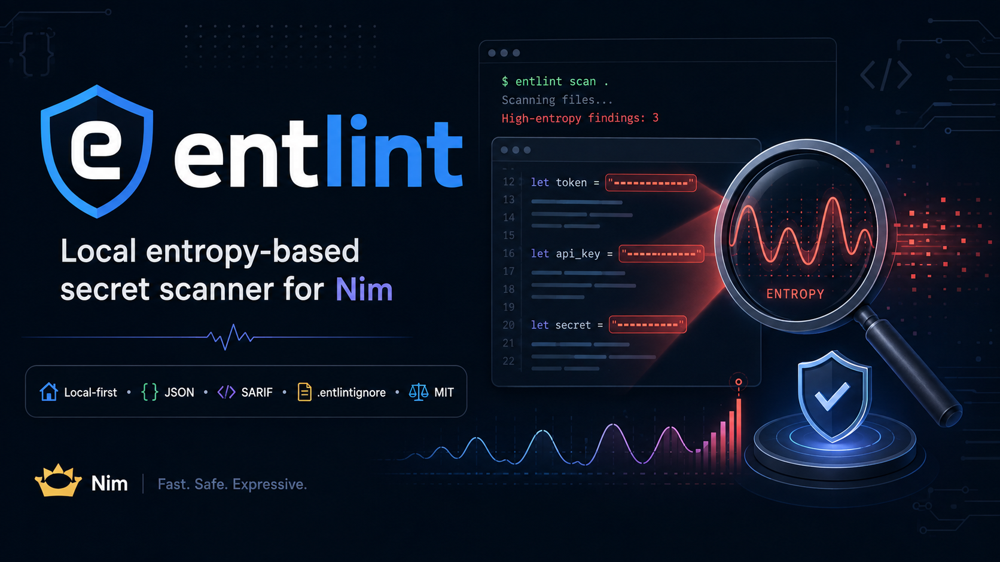

<p align="center">
  <strong>ENTLINT</strong>
</p>

<p align="center">
  <strong>Local-first entropy-based secret scanning for source trees, automation, and CI.</strong>
</p>

<p align="center">
  <a href="https://github.com/carnaverone/entlint/actions/workflows/test.yml"></a>
  
  
  
  
  <a href="LICENSE"></a>
</p>

<p align="center">
  <a href="#-quick-start">Quick Start</a> ·
  <a href="#-how-it-works">How It Works</a> ·
  <a href="#-cli-reference">CLI</a> ·
  <a href="#-output-safety">Output Safety</a> ·
  <a href="#-detection-quality">Detection Quality</a> ·
  <a href="SECURITY.md">Security</a> ·
  <a href="CONTRIBUTING.md">Contribute</a>
</p>

<p align="center">
  
</p>

---

> [!IMPORTANT]
> **A high-entropy finding is a review signal, not proof that a credential is valid.** `entlint` is intentionally local and provider-agnostic: it does not upload findings, authenticate against providers, or verify whether a detected value is live.

## 🛡️ entlint at a glance

| Capability | Current behavior |
|---|---|
| Current version | **0.2.0** |
| Runtime model | **Local-first** |
| Language | **Nim >= 2.0.0** |
| Detection | Shannon entropy + conservative candidate guards |
| Default threshold | **4.0 bits / character** |
| Default minimum token length | **20 characters** |
| Default maximum file size | **2 MiB** |
| Human output | Raw candidate values are **never printed** |
| Machine output | Native JSON + **SARIF 2.1.0** |
| Ignore configuration | `.entlintignore` + explicit ignore files |
| CI exit codes | `0` clean · `1` error · `2` findings |
| Runtime network access | **None** |
| CI platforms | Linux · macOS · Windows |
| License | **MIT** |

---

## 🔎 What is entlint?

`entlint` is a small native secret linter designed to detect suspicious **high-entropy token candidates** in source trees and individual text files.

It targets values that may represent accidentally committed:

- API keys;
- access tokens;
- generated credentials;
- opaque authentication material;
- password-like generated strings.

The scanner is deliberately narrow. It does **not** maintain a cloud-provider credential catalog, connect to remote verification services, or attempt to decide whether a credential is active.

That gives `entlint` a clear role: a lightweight, auditable **local guardrail** that can run before code reaches a remote service or before a CI job accepts a change.

---

## ✨ Why entlint?

| Property | What it means |
|---|---|
| 🏠 **Local-first** | Scanning happens on the machine running `entlint`. |
| 🔐 **Secret-safe output** | Raw candidate tokens are never emitted to human, JSON, or SARIF output. |
| ⚡ **Native CLI** | A compact Nim implementation builds to one native executable. |
| 🤖 **Automation-ready** | Stable exit codes make findings usable as CI gates. |
| 🧾 **Structured output** | JSON for automation and SARIF 2.1.0 for security tooling. |
| 🧭 **Bounded traversal** | Recursive scanning skips symlinks and special file objects. |
| 🧩 **Repository tuning** | `.entlintignore`, explicit excludes, thresholds, lengths, and size limits. |
| 🧪 **Regression corpus** | Detection trade-offs are tracked with labeled synthetic test cases. |

For deep Git-history scanning or provider-aware credential verification, use specialized tooling such as Gitleaks or TruffleHog alongside `entlint`.

---

## ⚡ Quick Start

### Build from source

Requirements:

- Nim **2.0.0+**
- Nimble

```bash
git clone https://github.com/carnaverone/entlint.git
cd entlint

nimble build -d:release

./entlint --version
```

Optional user-local installation:

```bash
mkdir -p ~/.local/bin
cp ./entlint ~/.local/bin/entlint
```

### Scan the current repository

```bash
entlint scan .
```

### Scan one file

```bash
entlint file ./config.txt --lines
```

### Show line numbers and masked previews

```bash
entlint scan . --lines --preview
```

### Generate JSON

```bash
entlint scan . --json
```

### Generate SARIF 2.1.0

```bash
entlint scan . --sarif > entlint.sarif
```

### Tune a scan

```bash
entlint scan . \
  --min 4.2 \
  --min-length 24 \
  --max-size 4MiB \
  --exclude fixtures \
  --exclude vendor
```

The legacy v0.1-style form remains accepted:

```bash
entlint --path . --threshold 4.0
```

---

## 🖥️ Example finding

Human-readable output intentionally masks the candidate:

```text
HIGH src/example.txt:12 entropy=4.625 len=32 preview="Ab************************yz"
entlint: findings=1 scanned=14 skipped=3
```

The original candidate is **not printed**. Without `--preview`, even the masked preview is omitted.

---

## 🧠 How it works

By default, a candidate must:

1. contain at least **20 characters**;
2. contain at least **two character classes**;
3. reach at least **4.0 bits/character** of Shannon entropy.

Additional guards reduce obvious noise from values such as UUIDs and obvious multi-segment URLs or filesystem-like paths.

```text
source text
    ↓
long token candidates
    ↓
identifier / obvious URL-path guards
    ↓
character-class check
    ↓
Shannon entropy threshold
    ↓
masked finding + deterministic exit code
```

Candidate characters currently include letters, digits and these separators:

```text
_ - + / . ~
```

JWT-shaped opaque values remain eligible for detection.

The detector remains intentionally heuristic. False positives and false negatives are possible, and findings require review.

---

## 🎛️ CLI reference

```text
entlint scan [PATH] [options]
entlint file FILE [options]
```

| Option | Purpose |
|---|---|
| `--min N`, `--threshold N` | Shannon entropy threshold; default `4.0` |
| `--min-length N` | Minimum candidate length; default `20` |
| `--max-size N` | Maximum file size; bytes, `K/KiB`, or `M/MiB` |
| `--exclude PATTERN` | Exclude paths containing `PATTERN`; repeatable |
| `--ignore-file FILE` | Load an additional path-fragment ignore file; repeatable |
| `--no-ignore-file` | Disable automatic scan-root `.entlintignore` loading |
| `--no-default-excludes` | Disable built-in directory exclusions |
| `--preview` | Show a **masked** candidate preview |
| `--lines` | Include line numbers in human output |
| `--json` | Emit native entlint JSON |
| `--sarif` | Emit SARIF 2.1.0 |
| `--version` | Print version |
| `-h`, `--help` | Show help |

`--json` and `--sarif` are mutually exclusive.

`--exclude` performs a case-sensitive path-substring match. It is **not** gitignore/glob syntax.

---

## 🗂️ Default scan boundaries

The following directory components are excluded by default:

```text
.git
node_modules
nimcache
zig-cache
zig-out
target
dist
build
.cache
```

Regular files merely named `build` or `target` remain eligible for scanning; the built-in exclusions target directory components.

Recursive traversal:

- does not follow symlinks;
- skips special file objects;
- skips binary files containing NUL bytes;
- skips files above the configured maximum size.

An explicit symlink supplied as a scan target is refused rather than followed outside the requested boundary.

---

## 🚫 `.entlintignore`

When scanning a directory, `entlint` automatically looks for:

```text
<scan-root>/.entlintignore
```

It does **not** search parent directories.

Example:

```text
# generated fixtures
fixtures/generated/
docs/snapshots/
third_party/cache.bin
```

Rules are intentionally small and deterministic:

- blank lines are ignored;
- lines whose first non-whitespace character is `#` are comments;
- active lines use **case-sensitive path substring** matching;
- `\` is normalized to `/` for matching;
- `*` and `?` have no glob semantics;
- `!` negation is not implemented.

Additional ignore files can be supplied explicitly:

```bash
entlint scan . \
  --ignore-file ./config/ci.entlintignore
```

`--ignore-file` is repeatable. `--no-ignore-file` disables only automatic scan-root loading; explicitly supplied files are still loaded.

For safety, ignore files:

- must be regular files;
- cannot be symlinks;
- reject NUL or control characters in active rules;
- are limited to **256 KiB**;
- are limited to **2,048 active rules**;
- are limited to **4,096 characters per rule**.

> [!WARNING]
> Ignore configuration changes the scanner's visibility. Treat `.entlintignore` changes like other security-sensitive repository configuration.

---

## 🔐 Output safety

The scanner is designed not to become another secret-exfiltration surface.

### Human output

Raw candidate values are never printed.

### JSON

JSON contains finding metadata rather than the original candidate:

```json
{
  "version": "0.2.0",
  "target": ".",
  "threshold": 4.0,
  "min_length": 20,
  "scanned_files": 14,
  "skipped_entries": 3,
  "errors": 0,
  "findings_count": 1,
  "findings": [
    {
      "path": "src/example.txt",
      "line": 12,
      "entropy": 4.625,
      "length": 32
    }
  ]
}
```

A preview appears only when explicitly requested with `--preview`, and remains masked.

### SARIF

SARIF output never includes the raw candidate token or a candidate preview. It reports rule metadata, entropy/length context, file location and line number.

Human-readable paths and error messages are sanitized so control characters cannot inject extra terminal or CI log lines.

---

## 🧾 SARIF 2.1.0

```bash
entlint scan . --sarif > entlint.sarif
```

| Contract | Current behavior |
|---|---|
| SARIF version | `2.1.0` |
| Tool name | `entlint` |
| Rule ID | `ENTLINT001` |
| Rule name | `HighEntropySecretCandidate` |
| Physical file location | Yes |
| `startLine` | Yes |
| Raw secret | **Never** |
| Network upload | **Never performed by entlint** |

A clean scan still emits valid SARIF with an empty `results` array. Findings still return exit code `2`, even when the SARIF document is successfully written.

Uploading SARIF to GitHub Code Scanning or another consumer is a separate operator or CI action outside the `entlint` runtime.

---

## 🚦 Exit codes

| Code | Meaning |
|---:|---|
| `0` | Scan completed with no findings |
| `1` | Usage, I/O, safety-boundary, ignore-configuration, or scan error |
| `2` | One or more suspicious candidates found |

That makes a CI gate straightforward:

```yaml
- name: Secret entropy check
  run: ./entlint scan .
```

A finding exits with code `2`, allowing a pipeline to stop before suspicious content is accepted.

---

## 🧪 Detection quality

`entlint` includes a public **synthetic regression corpus** so heuristic trade-offs are measured rather than hidden.

Current `v0.2.0` controlled baseline:

| Metric | Value |
|---|---:|
| Corpus cases | **22** |
| True positives | **8** |
| False negatives | **0** |
| True negatives | **10** |
| False positives | **4** |
| Recall on labeled positive cases | **100%** |
| Precision | **66.7%** |
| Specificity | **71.4%** |

The four known false positives are structured release/version/package/filename identifiers. They are deliberately documented rather than silently suppressed with an unproven heuristic.

The corpus fails CI if a labeled positive becomes a false negative or if the known false-positive count regresses beyond the documented bound.

> [!NOTE]
> These metrics describe only a **small controlled synthetic regression corpus**. They are not claims of real-world detection accuracy.

See [`docs/DETECTION_CORPUS.md`](docs/DETECTION_CORPUS.md) for the labeled case classes, derived metrics and expansion rules.

---

## 🛡️ Security model

`entlint` is deliberately constrained.

It:

- performs no runtime network requests;
- uploads no files, findings, JSON, or SARIF;
- never validates credentials against providers;
- never prints raw candidate secrets;
- does not recursively follow symlinks;
- refuses explicit symlink scan targets;
- refuses symlinked ignore files;
- skips binary files containing NUL bytes;
- bounds file size by default;
- sanitizes human-readable paths and errors;
- uses synthetic test credentials only.

For responsible disclosure and operational constraints, see:

- [`SECURITY.md`](SECURITY.md)
- [`SECURITY_OPERATION_POLICY.md`](SECURITY_OPERATION_POLICY.md)

---

## ⚖️ What entlint is — and is not

| entlint is | entlint is not |
|---|---|
| Lightweight local secret-linting guardrail | Credential-validity checker |
| Entropy-based candidate detector | Provider credential catalog |
| Current source-tree scanner | Dedicated Git-history scanner |
| CI failure gate | Remote security service |
| JSON/SARIF producer | Automatic SARIF uploader |
| Review-signal generator | Proof that a finding is an active secret |

For deeper repository-history or provider-aware detection, use specialized tooling alongside `entlint`.

---

## ✅ CI and release validation

Normal CI validates `entlint` across:

| Platform | Nim 2.0.0 | Stable Nim |
|---|:---:|:---:|
| Ubuntu | ✅ | ✅ |
| Windows | ✅ | ✅ |
| macOS | ✅ | ✅ |

Release automation additionally verifies the release tag, default-branch ancestry, source/package/README/CHANGELOG version agreement, tests, native builds, clean/finding smoke tests, masked-output behavior and SHA-256 checksum generation before publication.

---

<details>
<summary><strong>🧩 Detection model details</strong></summary>

`entlint` is provider-agnostic and does not maintain prefix-specific rules for cloud vendors.

Candidate characters currently include:

```text
A-Z
a-z
0-9
_ - + / . ~
```

Candidates must meet the configured minimum length and contain at least two character classes before entropy analysis.

JWT-shaped opaque values remain eligible for detection. UUIDs and obvious multi-segment URL/path forms receive targeted false-positive filtering.

A finding is a **review signal**, not proof that the candidate is a usable credential.

</details>

<details>
<summary><strong>🧪 Test coverage</strong></summary>

The suite covers scanner logic, the compiled CLI and detection-quality regression cases, including:

- entropy and tokenization;
- masked output guarantees;
- line-number reporting;
- UUID and URL/path false-positive guards;
- JWT-shaped opaque-token detection;
- native JSON output;
- SARIF 2.1.0 structure, rule metadata and locations;
- clean SARIF with an empty result set;
- `--json` / `--sarif` mutual exclusion;
- exit codes `0`, `1`, and `2`;
- binary-file skipping;
- maximum-size skipping and overflow rejection;
- explicit exclusions;
- automatic `.entlintignore` loading;
- explicit `--ignore-file` loading;
- malformed, oversized, missing and symlinked ignore-file rejection;
- default directory exclusions;
- explicit symlink-target refusal on POSIX;
- control-character sanitization;
- invalid or non-finite entropy thresholds;
- TP/FP/TN/FN regression bounds across the synthetic corpus.

The tests use synthetic values assembled at runtime. **Do not add real credentials or copied production tokens to fixtures.**

</details>

<details>
<summary><strong>🏗️ Repository structure</strong></summary>

```text
entlint/
├── README.md
├── CHANGELOG.md
├── LICENSE
├── SECURITY.md
├── SECURITY_OPERATION_POLICY.md
├── CONTRIBUTING.md
├── AGENTS.md
├── REPO_BOUNDARY.md
├── entlint.nimble
├── src/
│   └── entlint.nim
├── tests/
│   ├── test_cli.nim
│   └── test_detection_corpus.nim
├── docs/
│   ├── assets/
│   │   └── entlint.png
│   ├── DETECTION_CORPUS.md
│   └── RELEASE_CHECKLIST.md
└── .github/
    └── workflows/
```

</details>

<details>
<summary><strong>⚙️ Known limitations</strong></summary>

Current limitations are explicit:

- entropy detection is heuristic and can produce false positives and false negatives;
- some long structured release/version/package/filename identifiers are documented false positives;
- provider-side credential validity is not checked;
- Git history is not scanned separately from files present in the selected tree;
- eligible files are currently read into memory rather than streamed;
- `.entlintignore` uses substring rules rather than gitignore-compatible glob/negation semantics;
- binary content containing NUL bytes and oversized files are skipped by design.

These limits are part of the public contract rather than hidden implementation details.

</details>

---

## 🗺️ Roadmap

Current follow-up work is tracked publicly:

| Area | Direction |
|---|---|
| Detection precision | Reduce structured-identifier false positives without corpus regressions |
| Corpus | Expand audited benign and positive synthetic cases |
| Large files | Add bounded streaming analysis |
| SARIF | Add stable privacy-preserving fingerprints |
| Repository governance | Protect `main` with required review/CI policy |

See the [GitHub issue tracker](https://github.com/carnaverone/entlint/issues).

---

## 🤝 Contributing

Contributions are welcome, especially changes that preserve the project's narrow security model:

- detection-quality improvements;
- synthetic corpus expansion;
- false-positive reduction;
- output-format interoperability;
- cross-platform behavior;
- documentation and reproducibility;
- bounded performance improvements.

Start with [`CONTRIBUTING.md`](CONTRIBUTING.md).

Do **not** submit real credentials or copied production secrets as fixtures.

---

## 📖 Documentation

| Need | Document |
|---|---|
| Security reporting and guarantees | [`SECURITY.md`](SECURITY.md) |
| Operational security boundaries | [`SECURITY_OPERATION_POLICY.md`](SECURITY_OPERATION_POLICY.md) |
| Detection corpus and metrics | [`docs/DETECTION_CORPUS.md`](docs/DETECTION_CORPUS.md) |
| Release gates | [`docs/RELEASE_CHECKLIST.md`](docs/RELEASE_CHECKLIST.md) |
| Contribution workflow | [`CONTRIBUTING.md`](CONTRIBUTING.md) |
| Repository boundaries | [`REPO_BOUNDARY.md`](REPO_BOUNDARY.md) |
| Release history | [`CHANGELOG.md`](CHANGELOG.md) |

---

## 📜 License

`entlint` is released under the **MIT License**.

See [`LICENSE`](LICENSE).

---

## Maintainer

Maintained by **Carnaverone Studio**.

Copyright © 2025–2026 Carnaverone.
